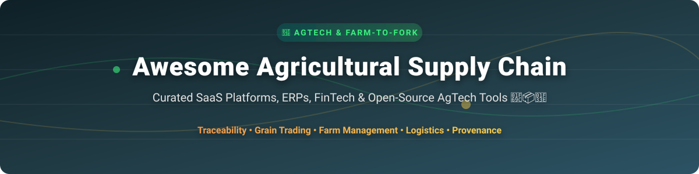

# Awesome Agricultural Supply Chain 🌾📦🚜

  
  
  
  

## 📌 Top Agricultural Supply Chain Ecosystem & AgTech Software 🌾

**Curated List of Leading SaaS Platforms, Agri-FinTech Enterprise Tools & Open-Source GitHub Projects** 🚀

*Focused on Farm-to-Fork Traceability, Grain & Produce Trading, Inventory Management, Commodity Contracts, Agritech Payments, ESG Auditing & Digital Ag Supply Chain Platforms.* 🌾📦

---

## 📊 Market Overview & Industry Structure 💡

> **Market Size & Dynamics**: The Global Agricultural Supply Chain & Management Software Market is estimated at **$1.8 Billion in 2024** and is projected to reach **$3.8 Billion by 2030** (growing at a CAGR of ~13.2%).
>
> **Market Structure**: The sector is **Moderately Fragmented**. While commercial giants lead grain marketing and financial services in North America and Australia, hundreds of specialized regional platforms, local food hubs, and open-source traceability projects serve distinct commodity niches (fresh produce, coffee, dairy, grains) globally.

---

## 📋 Table of Contents 📑

- [💻 SaaS & Hosted Platforms](#-saas--hosted-platforms)
- [🔓 Open-Source GitHub Projects](#-open-source-github-projects)
- [🤝 How to Contribute](#-how-to-contribute)
- [💖 Support & Sponsorship](#-support--sponsorship)
- [📈 Star History](#-star-history)
- [⚠️ Disclaimer](#%EF%B8%8F-disclaimer)

---

## 💻 SaaS & Hosted Platforms 🏢

*Commercial agtech software solutions providing enterprise grain trading, fresh produce inventory financing, logistics, and commodity market connectivity. Sorted by estimated enterprise valuation / total funding (descending).* 📈

| Platform 🚀 | Description 📝 | Valuation / Revenue 💰 | Specific Pricing Tier 🏷️ | Free Tier / Trial Limit ⏳ |
| :--- | :--- | :--- | :--- | :--- |
| **[ProducePay](https://producepay.com/)** 🍓 | Fresh produce supply chain platform combining trade financing, payment visibility, and grower-buyer programs. | **$100M - $250M Est. Valuation** ($300M+ Total Funding) | Membership model + Commission fees (~1-3% per trade transaction) | Free grower account registration & market insights; paid finance services |
| **[Cropin](https://www.cropin.com/)** 🌾 | AI-first agri-food intelligence platform for grower network digitization, supply-chain visibility, and predictive risk insights. | **$91M Valuation** ($38M - $63M Est. Revenue) | Custom Enterprise Plan (Starts at ~$2,500/year for business units) | 14-day Enterprise demo trial available upon request |
| **[Bushel](https://bushelpowered.com/)** 🚜 | Digital grain platform connecting growers, elevators, and ag-retailers with grain marketing, digital payments, and inventory visibility. | **$75M - $150M Est. Valuation** ($60M+ Funding) | **$75 / year** (Bushel Farm Lite Tier) up to **$599 / year** (Essentials Tier) | 14-day free trial on Bushel Farm plans with standard features |
| **[SourceTrace](https://www.sourcetrace.com/)** 🌴 | Software for farm-to-fork commodity traceability, ESG compliance, smallholder farmer management, and supply chain auditability. | **$15M - $30M Est. Valuation** ($3M - $5M Est. Revenue) | Monthly software subscription scaling per farmer/acre (Starts ~$150/month) | Free live demo session; no standalone free-forever tier |
| **[AgriDigital](https://www.agridigital.io/)** 🌾 | Grain supply chain management platform for contracts, delivery tracking, inventory storage, and embedded harvest finance. | **$12M - $25M Est. Valuation** ($1.7M ARR) | Platform license starting from **$250 / month** + volume processing fees | 14-day free trial for AgriDigital Onfarm platform |

---

## 🔓 Open-Source GitHub Projects 🌾

*Production-ready open-source software, farm management frameworks, and blockchain-backed traceability projects for regional food networks and transparent provenance. Sorted by GitHub Stars_Counts (descending).* ⭐

| Project 🚀 | Description 📝 | Stars_Count 🌟 | License 📄 |
| :--- | :--- | :--- | :--- |
| **[farmOS](https://github.com/farmos/farmOS)** 🚜 | Web-based farm management, planning, mapping, inventory, and record-keeping application built for farmers, researchers, and supply networks. |  | GPL-2.0 |
| **[Open Food Network](https://github.com/openfoodfoundation/openfoodnetwork)** 🥗 | Open-source online marketplace platform connecting farmers, local food hubs, and consumers for sustainable regional food distribution. |  | AGPL-3.0 |
| **[Tania](https://github.com/Tanibox/tania)** 🌱 | Open-source farm management system for hydroponics, aquaponics, and agricultural inventory tracking. |  | Apache-2.0 |
| **[Blockchain Automation Framework](https://github.com/hyperledger-labs/blockchain-automation-framework)** ⛓️ | Hyperledger lab project providing deployment automation for supply-chain blockchains including food provenance networks. |  | Apache-2.0 |
| **[LiteFarm](https://github.com/LiteFarmOrg/LiteFarm)** 👨‍🌾 | Open-source community-driven farm management application designed for sustainable farmers to manage operations and certifications. |  | GPL-3.0 |
| **[Hyperledger Grid](https://github.com/hyperledger/grid)** 📦 | WebAssembly-based platform for building enterprise supply-chain solutions, including agricultural tracking and product domain models. |  | Apache-2.0 |
| **[INATrace](https://github.com/agstack/inatrace-backend)** ☕ | Open-source, blockchain-based track-and-trace system for agricultural supply chains (coffee, cocoa) under Linux Foundation AgStack. |  | GPL-3.0 |
| **[TraceFoodChain](https://github.com/agstack/tracefoodchain)** 🥑 | Mobile-first Flutter app for end-to-end ag supply chain traceability and EUDR deforestation compliance by AgStack. |  | Apache-2.0 |

---

## 🤝 How to Contribute 🛠️

Contributions are very welcome! To add a SaaS platform or Open-Source project to this repository:

1. 🍴 **Fork** this repository.
2. 📝 **Add/Update** entries in `README.md` following the exact table structure.
3. 🔎 **Provide Factual Details**: Include pricing, trial limits, market valuation, and official links.
4. 📬 **Open a Pull Request** with a brief overview of changes.

---

## 💖 Support & Sponsorship ☕

If you found this curated list of Agricultural Supply Chain software helpful, please consider supporting the project! Your encouragement helps keep this resource updated and maintained. 🌟

- ⭐ **Star this repository** to show appreciation!
- 🔀 **Fork & Share** with your network, agtech developers, and supply chain enthusiasts.
- ☕ **Buy Me a Coffee / Sponsor**: Support ongoing maintenance via [GitHub Sponsors](https://github.com/sponsors/ishandutta2007).

---

## 📈 Star History 📊

---

## ⚠️ Disclaimer 📜

- This repository is a **community-curated list** for informational and educational purposes only.
- Pricing, valuation, and trial details reflect market estimates and public filings as of late 2024 / 2026 and are subject to change by vendors.
- Agricultural supply chain software processes financial, contractual, and food safety data. Ensure compliance with local financial and agricultural regulations.
